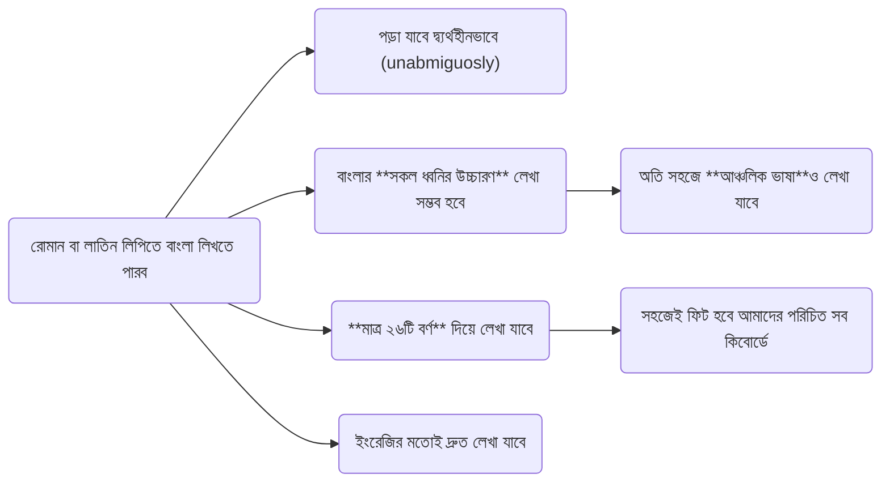
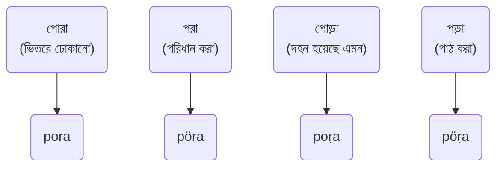
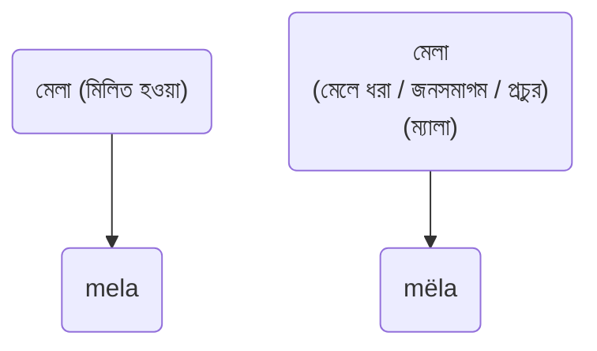
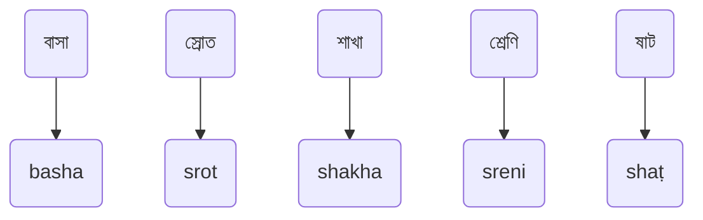

# Shörolipi
### Shörol + Shör + Lipi
## কী এই shörolipi?
### Key Features

## উদাহরণ

## ফোনে যেমন দেখাবে

> [!NOTE]
> ফোনে লেখার সময় লং প্রেস করে পরিবর্তিত বর্ণের পরিবর্তে মূল qwerty লেআউটের বর্ণগুলো লেখা যাবে। ফলে চাইলে ইংরেজিতে সুইচ না করেও বাংলা ইংরেজি মিলিয়ে একসাথে লেখা যাবে।

## হাইলাইটস
- বেশিরভাগ ধ্বনি আমাদের পরিচিত উপায়েই লেখা হবে। যেসব ধ্বনি লাতিন হরফে সরাসরি লেখা যায় না সেগুলোর জন্য বিশেষ হরফ ব্যবহার করা হবে, যেমন:

|    |    |        |   |   |   |    |   |   |
| :-:|:-:| :-:| :-: | :-: |:-:|:-:|:-:|:-:|
| অ | অ্যা | ঙ / ং | ট | ঠ | ড | ঢ | ড় | ঢ় | 
| ö |  ë   |   ŋ   | ṭ | ṭh| ḍ  | ḍh| ṛ | ṛh |
|    |    |        |   |   |   |    |   |   |

- এই লিপি সম্পূর্ণরূপে উচ্চারণ-নির্ভর হবে। যেমন:

## কীভাবে / কোথায় ব্যবহার করব?
1. ফোনে Heliboard -এ কাস্টোম লেআউট তৈরি করে লেখা যাবে
2. লিনাক্স পিসিতে [bn-shorolipi.mim for m17n](bn-shorolipi.mim) ব্যবহার করে লেখা যাবে।

## এক নজরে (ওভারভিউ)
Placeholder

## ইনস্টলেশন নির্দেশনা 
Placeholder

## আপনার মতামত দিন কিংবা ডেভেলপমেন্টে অবদান রাখুন
🔗 টেলিগ্রাম গ্রুপ: [**বাংলা লিখন বিপ্লব | shörolipi**](https://t.me/BanglaScriptRevolution)

### Authors
[@rank-coder](https://github.com/rank-coder)\
[@shoshostro](https://github.com/Shoshostro)

## বিস্তারিত নির্দেশনা
### ক্যাপিটালাইজেশন তথা বড়ো হাতের বর্ণের ব্যবহার

    
পড়তে ক্লিক করুন

1. বাক্যের শুরুতে বড়ো হাতের বর্ণ ব্যবহার করা হবে। যাতে বাক্যের শুরু সহজে খুঁজে পাওয়া যায় এবং পড়তে সুবিধা হয়।
2. মানুষের নাম, জায়গার নাম, ইত্যাদি, তথা **নামবাচক বিশেষ্যের** প্রথম বর্ণতে বড়ো হাতের বর্ণ ব্যবহার করা হবে। যেমন: Mirpur, Khulna, Robindronath, ইত্যাদি।
3. যদি ভবিষ্যতে shörolipi ব্যবহার করে কোনো অ্যাক্রোনিম (acronym), অথবা অ্যাব্রেভিয়েশন (abbreviation) তৈরি করা হয় তবে সেগুলোও বড়ো হাতের বর্ণে লেখা হবে।
4. অন্যান্য সকল ক্ষেত্রে সর্বদা ছোটো হাতের অক্ষর লেখা হবে।

### আঞ্চলিক ভাষা লেখা
দৈনন্দিন আলাপচারিতায় কিংবা আঞ্চলিক ভাষা লেখার সময় নিজের উচ্চারণ অনুযায়ী লেখা যাবে। যেমন: boltesi, jaitesi, ইত্যাদি।
### ঙ, ং ইত্যাদির উচ্চারণ লেখা

    
পড়তে ক্লিক করুন

Placeholder
    

### ঞ এর উচ্চারণ লেখা

    
পড়তে ক্লিক করুন

Placeholder
    

### অ এবং ও এর উচ্চারণ

    
পড়তে ক্লিক করুন

Placeholder
            

### শ, স, এবং, ষ এর উচ্চারণ

    
পড়তে ক্লিক করুন

Placeholder
                

### ন এবং ণ

    
পড়তে ক্লিক করুন

Placeholder
                    

### ট, ঠ, ড, ঢ এর উচ্চারণ লেখা

    
পড়তে ক্লিক করুন
                    
Placeholder

### ড়, ঢ় এর উচ্চারণ লেখা

    
পড়তে ক্লিক করুন

Placeholder
    

### চন্দ্রবিন্দুর উচ্চারণ লেখা
চন্দ্রবিন্দুর উচ্চারণ লেখা যথাসম্ভব এড়িয়ে যাওয়া হবে, যেহেতু আমাদের মূল লক্ষ্য হলো লিখনপদ্ধতিকে সহজ করা। তবে একান্ত প্রয়োজনে চন্দ্রবিন্দু লেখারও উপায় থাকবে।

### হ সংবলিত যুক্তবর্ণের উচ্চারণ লেখা

    
পড়তে ক্লিক করুন

aobhan

