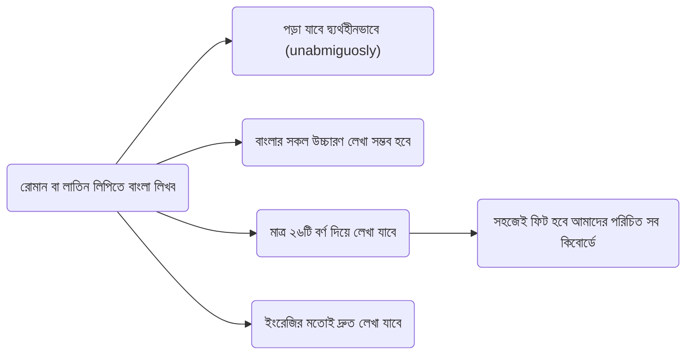
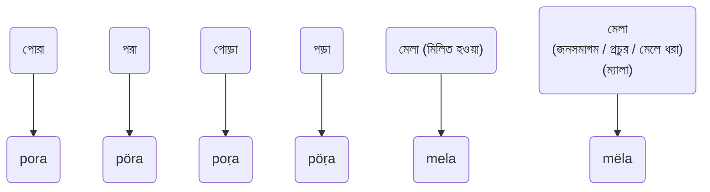

# Shörolipi
### Shörol + Shör + Lipi
## কী এই shörolipi?
### Key Features

## উদাহরণ

## ফোনে যেমন দেখাবে

## হাইলাইটস

## এক নজরে (ওভারভিউ)

### ইনস্টলেশন নির্দেশনা 

### কীভাবে ব্যবহার করব?

### আপনার মতামত দিন কিংবা ডেভেলপমেন্টে অবদান রাখুন
### Authors
@rank-coder
@shoshostro

