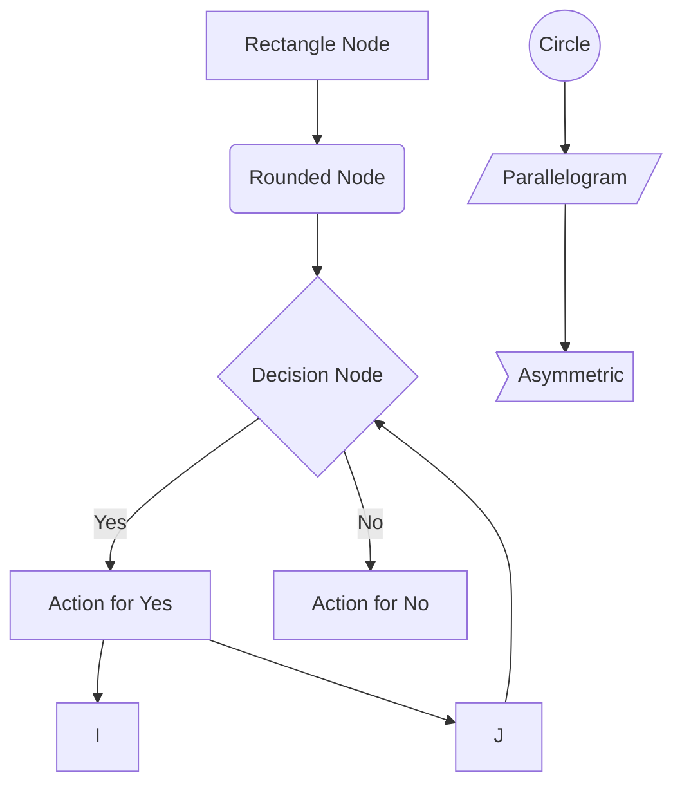
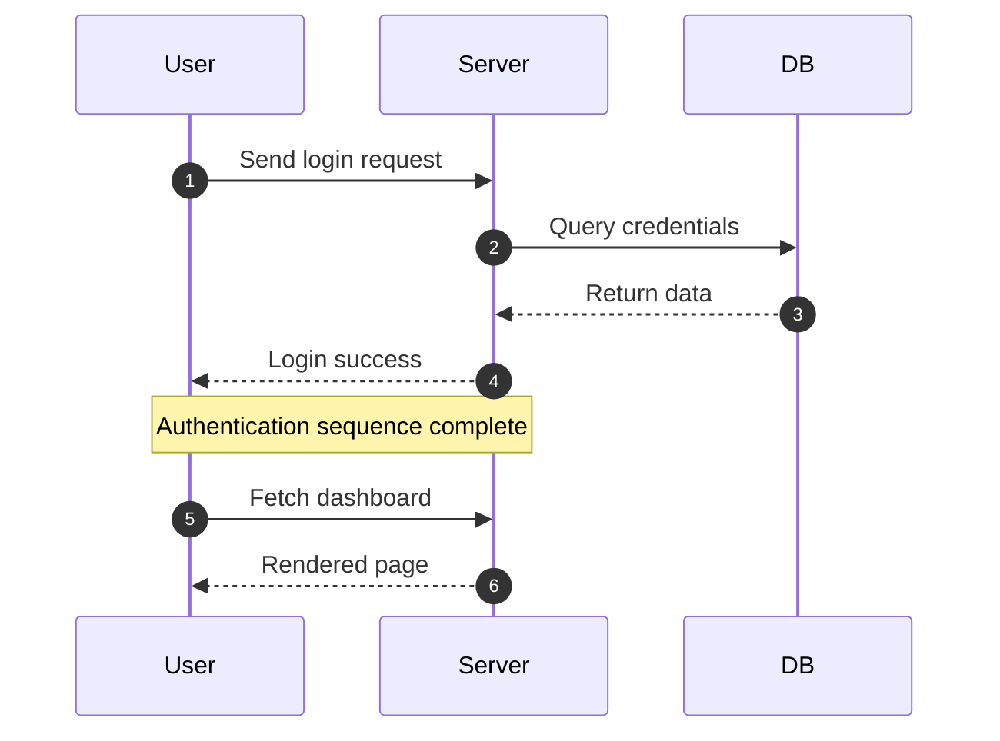
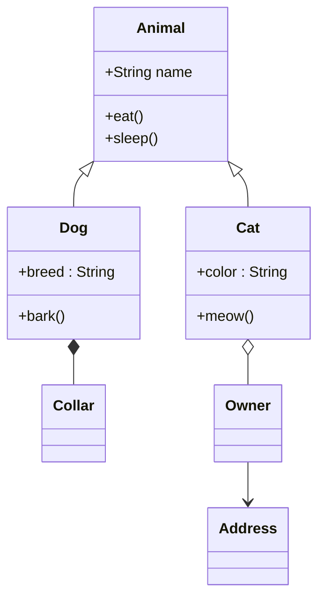
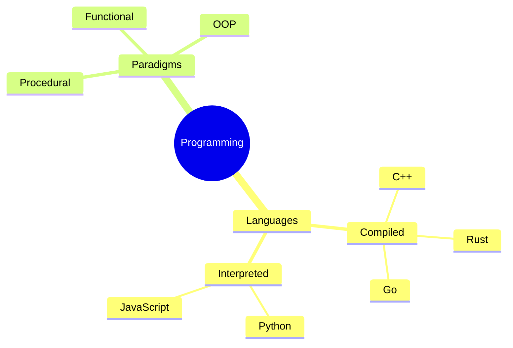
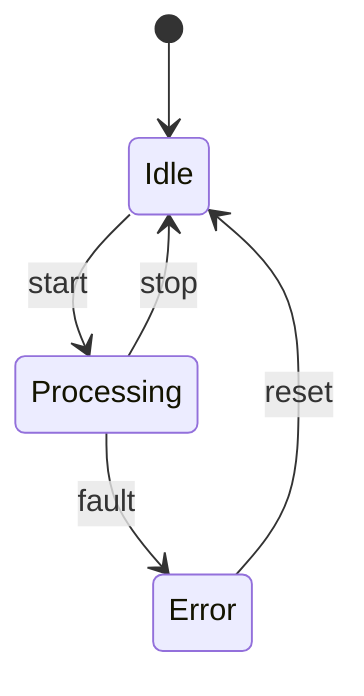
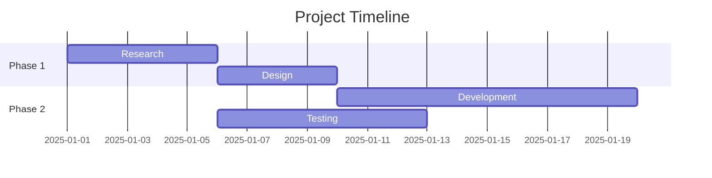
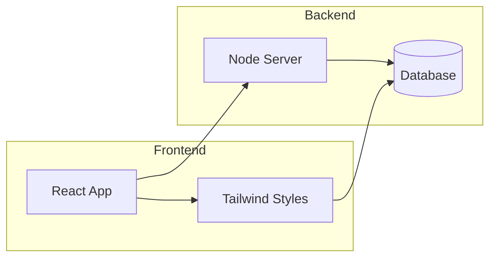
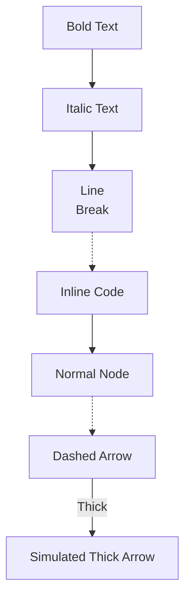

# Shörolipi
Shorol + Shor + Lipi = Shorolipi
What is shorolipi?

### হাইলাইটস

### এক নজরে (ওভারভিউ)
সফটওয়্যারটা কী করে, কীভাবে কাজ করে, আর কারা বানিয়েছে। আলাদা আলাদা সেকশনে থাকবে।

### ইনস্টলেশন নির্দেশনা 
লাগবে না

### কীভাবে ব্যবহার করব?

### আপনার মতামত দিন কিংবা ডেভেলপমেন্টে অবদান রাখুন

### Flowchart Demo

### Sequence Diagram Demo

### Class Diagram Demo (GitHub Compatible)

### Mindmap Demo

### State Diagram Demo

### Gantt Chart Demo

### Subgraph Demo

### Styling Demo (GitHub Compatible)

