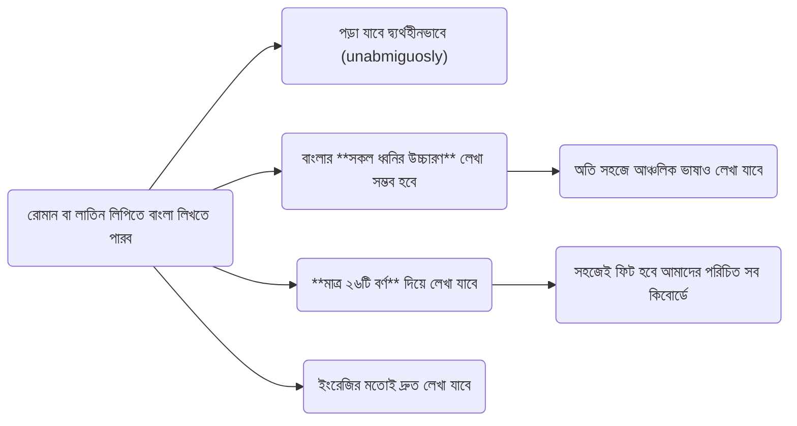
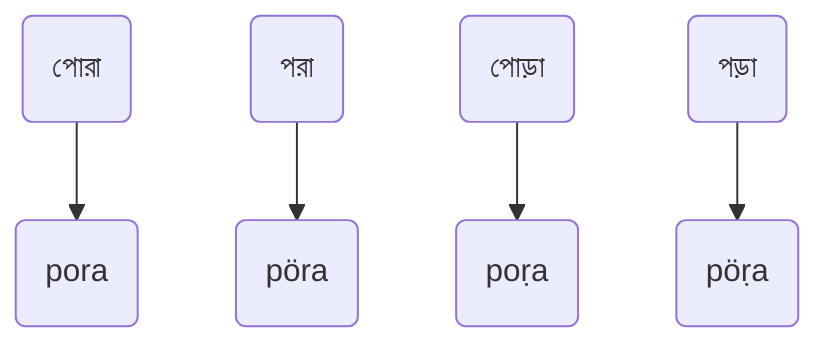
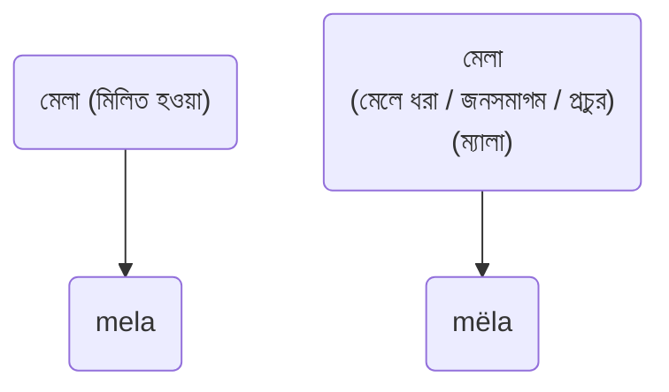
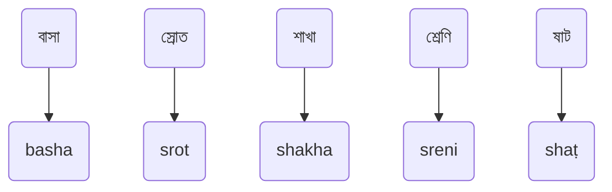

# Shörolipi
### Shörol + Shör + Lipi
## কী এই shörolipi?
### Key Features

## উদাহরণ

## ফোনে যেমন দেখাবে

## হাইলাইটস
#### বেশিরভাগ ধ্বনি আমাদের পরিচিত উপায়েই লেখা হবে। যেসব ধ্বনি লাতিন হরফে সরাসরি লেখা যায় না সেগুলোর জন্য বিশেষ হরফ ব্যবহার করা হবে, যেমন:
|    |    |        |   |   |   |    |   |   |
| :-:|:-:| :-:| :-: | :-: |:-:|:-:|:-:|:-:|
| অ | অ্যা | ঙ / ং | ট | ঠ | ড | ঢ | ড় | ঢ় | 
| ö |  ë   |   ŋ   | ṭ | ṭh| ḍ  | ḍh| ṛ | ṛh |
|    |    |        |   |   |   |    |   |   |

#### এই লিপি সম্পূর্ণরূপে উচ্চারণ-নির্ভর হবে। যেমন:

## এক নজরে (ওভারভিউ)

### ইনস্টলেশন নির্দেশনা 

### কীভাবে ব্যবহার করব?
### আপনার মতামত দিন কিংবা ডেভেলপমেন্টে অবদান রাখুন
### Authors
@rank-coder  
@shoshostro

## বিস্তারিত নির্দেশনা
### ক্যাপিটালাইজেশন তথা বড়ো হাতের বর্ণের ব্যবহার
### 

